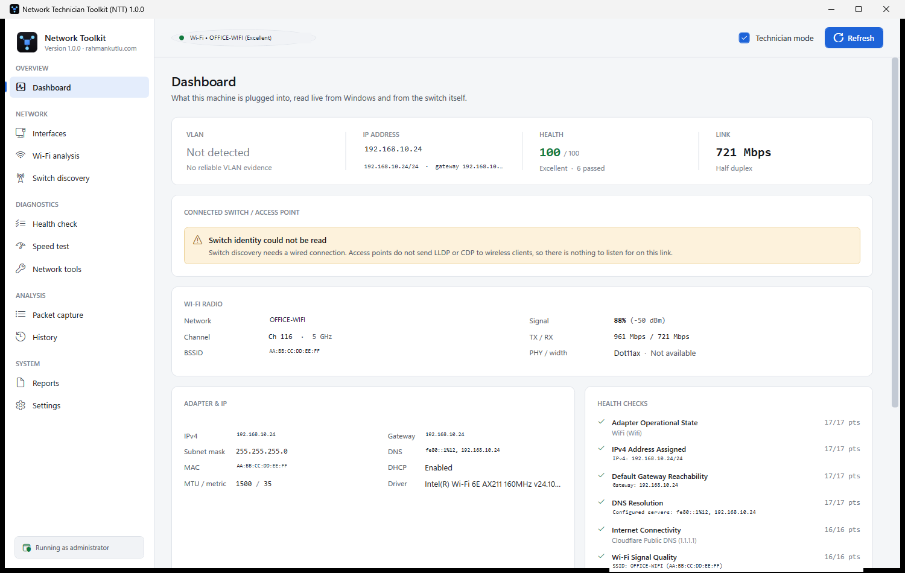
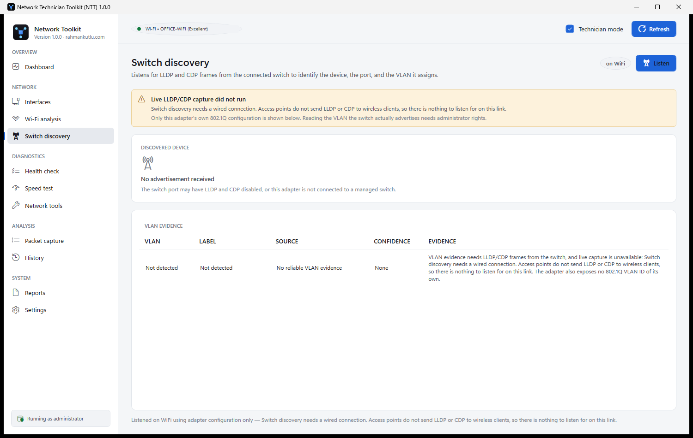
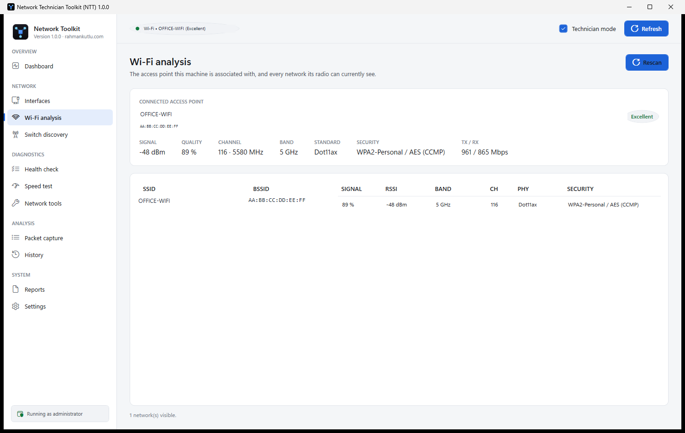
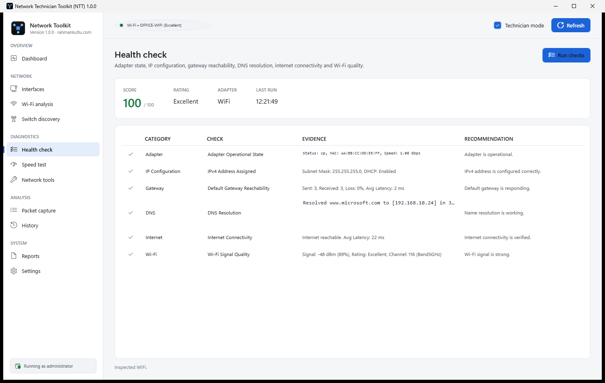
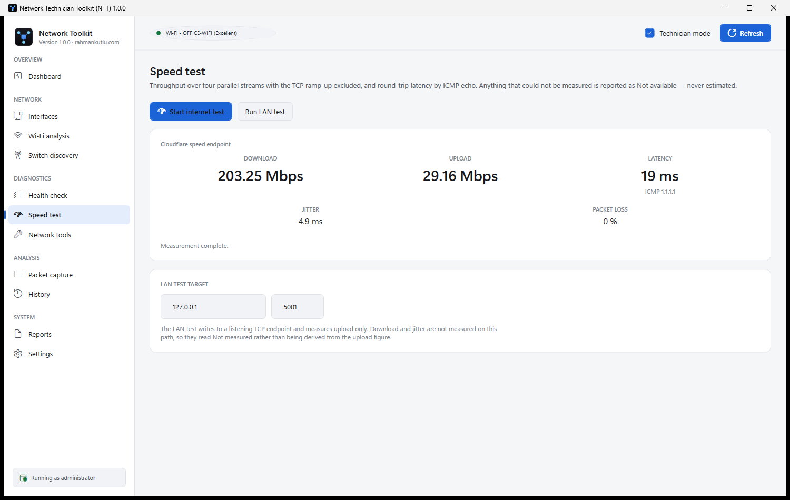
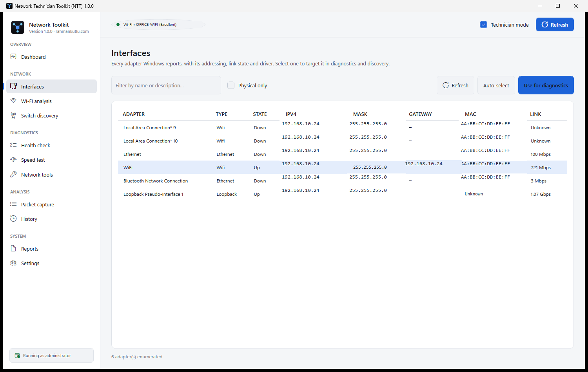
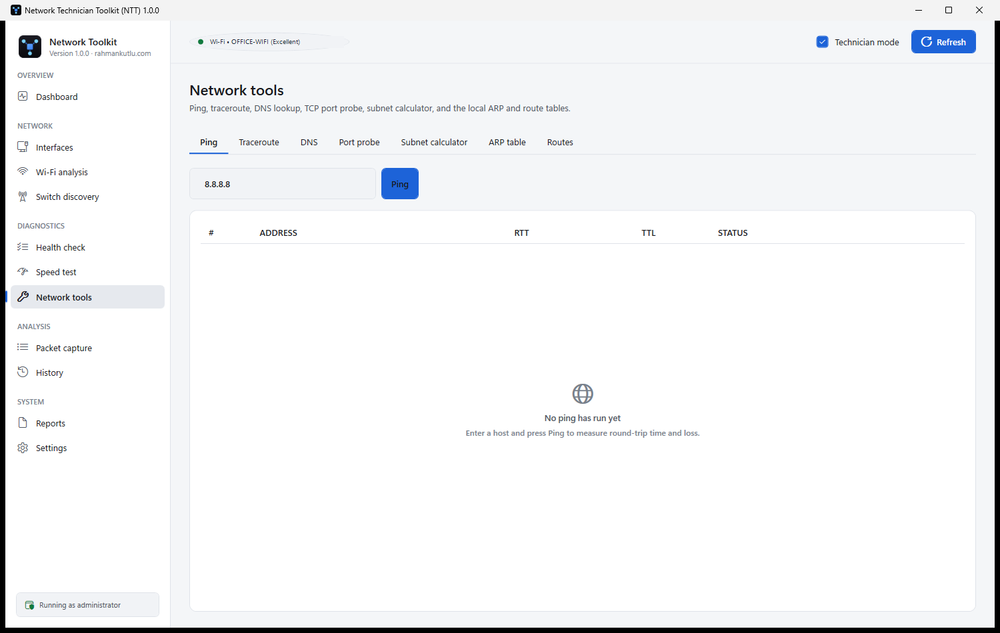
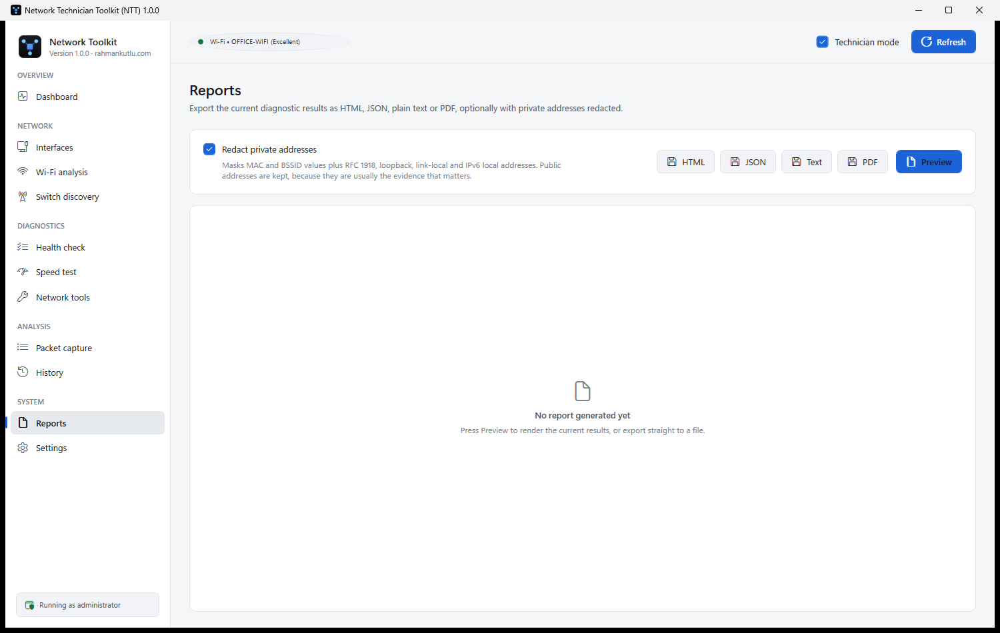

<div align="center">



# Network Technician Toolkit

**A free Windows network diagnostics toolkit for technicians.**

Find out what a machine is actually plugged into — the switch port, the VLAN, why DNS is slow,
whether the gateway answers — and hand someone a report that proves it.

[](../../releases/latest)
[](#requirements)
[](#licence)
[](#requirements)
[](#requirements)

## ⬇ Download

| | File | Size | |
|---|---|---|---|
| **Installer** | [**NTT-Setup-1.0.0-win-x64.exe**](https://github.com/rahmankutlu/network-technician-toolkit/releases/download/v1.0.0/NTT-Setup-1.0.0-win-x64.exe) | 132 MB | Installs machine-wide, with an uninstaller |
| **Portable** | [**NTT-Portable-1.0.0-win-x64.zip**](https://github.com/rahmankutlu/network-technician-toolkit/releases/download/v1.0.0/NTT-Portable-1.0.0-win-x64.zip) | 69 MB | Extract and run — no installation |
| **Checksums** | [**SHA256SUMS.txt**](https://github.com/rahmankutlu/network-technician-toolkit/releases/download/v1.0.0/SHA256SUMS.txt) | 193 B | **Verify your download before running it** |

**[→ All releases](../../releases/latest)**

*No .NET runtime needed. No extra drivers. Windows 10 (1809+) / 11, 64-bit.*

</div>

---

> **Binary-only release.** The source code is not published here, and NTT is **not** open-source
> software. It is free to download and use under the terms in [LICENSE](LICENSE).

---

## The one rule this tool is built on

**Never turn uncertainty into fake certainty.**

Most network tools fill gaps with plausible-looking numbers. NTT refuses to. Every value it
shows either came from somewhere it can name, or it says why it is missing — and it
distinguishes between reasons a technician would act on differently:

| What you see | What it actually means |
|---|---|
| `Not detected` | Nothing was heard at all — no frame arrived in the listening window |
| `Not advertised` | A neighbour *was* heard, but it never mentioned this field |
| `Not available` | The value exists, but Windows will not expose it on this machine |
| `Timed out` | The check ran and did not finish — not a pass, and not a failure |
| `Not measured` | Deliberately not derived from something else |

A speed test that could not measure upload reports **Not available**, never a number
estimated from the download. A VLAN that was never advertised reports **Not detected**, never
`VLAN 0`.

---

## What it shows you

### Dashboard — the whole picture on one screen

VLAN, IP, health score and link state across the top; the switch you are connected to; the
Wi-Fi radio; addressing; and every health check with the evidence behind it.


---

### Switch discovery — the VLAN, with its evidence

NTT listens for the **LLDP** and **CDP** frames your switch already broadcasts, and reports the
device, the port and the VLAN it assigns.

Crucially, it reports **how confident it is and why**. In the screenshot below there is no
wired switch to listen to, so instead of inventing a VLAN it explains exactly what is missing
and what would be needed:



Every VLAN result carries its **source** (LLDP, CDP, or the adapter's own 802.1Q configuration),
a **confidence level**, the interface and a timestamp.

> Frames are read through **Windows Packet Monitor** (`pktmon`), built into Windows 10 1809 and
> later. **No Npcap, no WinPcap, no third-party driver is installed.**

---

### Wi-Fi analysis — the association and everything the radio can see

SSID, BSSID, RSSI in dBm, signal quality, channel, frequency, band, 802.11 standard, security,
authentication and cipher, and TX/RX rates — read from the Windows Native Wi-Fi API and
cross-checked against the adapter's own state.



---

### Health check — six checks, each with its evidence and its source

Adapter state, IP configuration, gateway reachability, DNS resolution, internet connectivity
and Wi-Fi quality. The checks run **concurrently**, each with its own timeout, and every result
records how long it took and which Windows facility produced it.



The score is a proportion of what was **actually checked**, and the per-check breakdown always
adds up to the number shown. A check that could not reach a verdict is listed at zero weight
rather than being quietly counted as a pass.

---

### Speed test — measured, never estimated

Download and upload measured **independently** over four parallel streams, with the TCP
slow-start excluded so the ramp does not flatter the result. Latency is the median ICMP round
trip, with jitter and packet loss where they can genuinely be measured.



---

### Interfaces — every adapter, with its addressing and link state

Pick one to target it in diagnostics and discovery, or let NTT auto-select the one carrying
your traffic.



---

### Network tools — the everyday set, in one place

Ping, traceroute, DNS lookup, TCP port probe, subnet calculator, ARP table and route table.
Every one runs off the UI thread, shows progress and can be cancelled.



---

### Reports — HTML, JSON, plain text or PDF

Export the current results in any of four formats, optionally with private addresses, MAC and
BSSID values, and identifying names redacted. Every report states whether it was redacted, so
whoever receives it can tell a masked export from a complete one.



Reports are written to `Documents\NTT Reports`.

---

### Also included

- **Packet capture** — live frames on the active adapter with LLDP, ARP, DNS and ICMP decoding.
- **History** — every sweep is stored locally so you can compare a machine before and after.
- **Technician mode** — a single toggle that adds the raw evidence behind every value: MTU,
  interface index, route metrics, driver version, TLV details and timing.

---

## Requirements

| | |
|---|---|
| **Operating system** | Windows 10 version 1809 (build 17763) or later, or Windows 11 — **64-bit** |
| **.NET runtime** | **None.** NTT ships self-contained |
| **Extra drivers** | **None.** No Npcap, no WinPcap |
| **Privileges** | **Administrator** — see below |
| **Disk** | ~310 MB installed |

### Why administrator?

Reading raw Ethernet frames — which is how LLDP/CDP switch discovery and packet capture work —
drives a kernel component that a normal user process cannot reach. Roughly half the product
would fail *after* you had already opened it. Asking once, at launch, is the honest alternative.

Windows will show a UAC prompt. NTT does not stay resident, install a service, or start with
Windows.

---

## Install

Download from the [latest release](../../releases/latest), then **verify the checksum** — see
[Before you run it](#before-you-run-it).

### Installer

Run **`NTT-Setup-1.0.0-win-x64.exe`**.

- Installs to `%ProgramFiles%\NTT` for every user on the machine
- Shows the licence terms before writing anything
- Creates Start Menu and optional Desktop shortcuts
- Registers a normal **Installed apps** entry with a working uninstaller
- Refuses to install over a running copy, or into a folder holding unrelated files

### Portable

Extract **`NTT-Portable-1.0.0-win-x64.zip`** anywhere — including a USB stick — and run
`NTT.exe`. Nothing is written outside the extracted folder and `%ProgramData%\NTT`.

### Unattended (Intune, SCCM, Group Policy, scripts)

Run elevated:

```powershell
NTT-Setup-1.0.0-win-x64.exe --install --silent
NTT-Setup-1.0.0-win-x64.exe --install --silent --dir "D:\Tools\NTT" --no-shortcuts --no-launch
```

| Switch | Effect |
|---|---|
| `--install --silent` | Install with no window and no prompts |
| `--dir "<path>"` | Install location (default `%ProgramFiles%\NTT`) |
| `--no-shortcuts` | Skip the Start Menu and Desktop shortcuts |
| `--no-launch` | Do not start NTT when the install finishes |

Exit code **0** on success, **1** on failure. A failure writes `%TEMP%\NTT-install-failure.log`.

### First launch is slower — this is normal

The first run from a new location takes roughly **6–15 seconds** while Microsoft Defender scans
the self-contained payload for the first time. Every launch after that is about **600 ms**. It
happens once per install location.

---

## Uninstall

From **Settings → Apps → Installed apps**, or:

```powershell
"C:\Program Files\NTT\NTT-Uninstall.exe" --uninstall --silent
"C:\Program Files\NTT\NTT-Uninstall.exe" --uninstall --silent --remove-data
```

Uninstalling removes the application, both shortcuts and the registry entry.

**Your history and settings in `%ProgramData%\NTT` are deliberately kept**, so a reinstall does
not lose your recorded sweeps. Tick the box in the uninstaller, or pass `--remove-data`, to
delete them too.

---

## Before you run it

### The binaries are intentionally unsigned

NTT 1.0.0 does not carry a commercial Authenticode code-signing certificate. This is a
deliberate decision for a free release, not an oversight.

**What you will see.** Windows has no verified publisher identity to attribute the download to,
so on first run SmartScreen may show:

> **Windows protected your PC**
> Microsoft Defender SmartScreen prevented an unrecognised app from starting.

and the UAC prompt will name an **Unknown publisher** rather than a company.

### How to get past it

The *Run anyway* button is hidden until you expand the dialog:

1. Click **More info** — *Turkish Windows: **Ek bilgi***
2. Click **Run anyway** — *Turkish Windows: **Yine de çalıştır***

**There is no way to make this warning disappear without a code-signing certificate.** Removing
the file's "downloaded from the internet" mark (Properties → Unblock) helps on some
configurations, but it is not dependable: recent Windows 11 builds evaluate unsigned
executables on reputation regardless of that mark, and the warning still appears. This is
Windows working as designed, and no setting inside the application changes it.

**Before you click Run anyway, satisfy yourself the file is genuine:**

1. **Download only from the official release page** of this repository — not a mirror, a
   file-sharing site or a search result.
2. **Verify the SHA-256 checksum** against `SHA256SUMS.txt` published on that same release page:

   ```powershell
   Get-FileHash NTT-Setup-1.0.0-win-x64.exe    -Algorithm SHA256
   Get-FileHash NTT-Portable-1.0.0-win-x64.zip -Algorithm SHA256
   ```

   If it does not match, **do not run the file**.
3. **Read the release notes**, including the known limitations.
4. **Scan it yourself** if you wish, with Defender or your own tooling.
5. **Only then**, if you are satisfied, continue past the warning.

A self-signed certificate is deliberately *not* used: it is trusted only on the machine that
created it, so it would remove the warning for nobody while implying a verification that never
happened. Only a certificate issued to a verified identity by a public CA changes what Windows
displays.

Every published build is scanned with Microsoft Defender before release. **A scan is evidence,
not a guarantee.**

---

## Privacy

NTT is a diagnostic tool, so it does send probe traffic — but only for the diagnostics it is
performing, and it sends nothing about you anywhere.

- **No telemetry, no analytics, no crash reporting, no update check, no account.**
- **Everything is stored locally**, in a SQLite database at `%ProgramData%\NTT\NTT.db`. Note
  this store is **machine-wide, not per-user**: any administrator of the machine can read it.
- **It does contact external hosts as part of diagnosing your network.** A dashboard refresh
  pings your gateway and `1.1.1.1`, and resolves one fixed hostname, to test connectivity. The
  speed test transfers data to and from a public speed endpoint. These are the measurements —
  nothing about you travels with them.
- **Reports can be redacted** before you send them.

### What redaction does not cover

Stated plainly, because a privacy claim that overstates itself is worse than none:

- **Public addresses are kept.** They are usually the evidence that matters in a report.
- **Hostnames inside free-text evidence are not masked** — only the named identity fields
  (computer name, adapter name, discovered device name) are.
- **Redaction is opt-in.** Exports made with it off contain everything in the clear.

**Read a redacted report before sending it.** Redaction reduces exposure; it does not guarantee
that nothing identifying remains.

---

## Known limitations

- **Unsigned binaries** — SmartScreen will warn on first run. Verify the checksum.
- **First launch takes 6–15 seconds** while Defender scans the payload.
- **Administrator rights are required** for switch discovery and packet capture. Without them
  NTT says so plainly rather than reporting "no switch found".
- **LLDP and CDP need a wired switch port that actually transmits them.** Many switches have
  them disabled, and access points never send them to wireless clients. NTT cannot detect what
  is not sent.
- **DNS latency is not attributable to a specific server.** Windows chooses among your
  configured resolvers, may answer from cache and may use DoH. The health check says so; use
  the DNS Lookup tool to interrogate one server directly.
- **The history store is machine-wide**, readable by any administrator of the machine.

### Not verified in this release

Recorded honestly rather than claimed:

- **Live LLDP/CDP against a physical switch.** The frame parsers are covered by extensive tests
  including malformed, truncated and random input, but no LLDP/CDP-speaking switch port was
  reachable during release verification.
- **6 GHz Wi-Fi.** 2.4 GHz and 5 GHz were exercised.

---

## Support

- **Bugs and feature requests** — open an issue on this repository. Please redact private
  addresses first; NTT's own report redaction can do it for you.
- **Security vulnerabilities** — please do **not** open a public issue. Use the **Security** tab
  → *Report a vulnerability*, or write to the contact address in [LICENSE](LICENSE) with
  `NTT SECURITY` in the subject.

---

## Licence

**NTT is free to download and use, but it is not open-source software.**

The source code is not published, and no open-source licence is granted. You may install and
run the published binaries on any number of machines you own or administer, including
commercially. You may not redistribute, resell, sublicense, host or create derivative works
from it without written permission.

See [LICENSE](LICENSE) for the full terms, and [THIRD-PARTY-NOTICES.md](THIRD-PARTY-NOTICES.md)
for the open-source components NTT redistributes, which carry their own licences.

---

<div align="center">

**Network Technician Toolkit 1.0.0** · © 2026 Abdurrahman KUTLU

</div>
